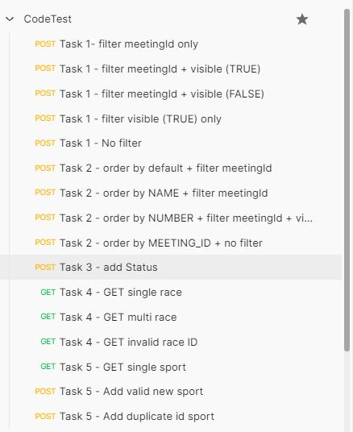

### Directory Structure

- `api`: A basic REST gateway, forwarding requests onto service(s).
- `racing`: A very bare-bones racing service.
- 'sports': A simple sport service

```
entain/
├─ api/
│  ├─ proto/
│  ├─ main.go
│  ├─ Test Script - postman/
├─ racing/
│  ├─ db/
│  ├─ proto/
│  ├─ service/
│  ├─ main.go
|─ sports/
│  ├─ db/
│  ├─ proto/
│  ├─ service/
│  ├─ main.go
├─ DevelopmentNotes.md
├─ README.md
```

### Run & Test the Service

1. In a terminal window, run API server
   ```
   cd ./api
   go build .
   go run .
   ➜ INFO[0000] API server listening on: localhost:8000
   ````

2. racing service
   1. start racing service in the 2nd terminal window
      ```
         cd ./racing
         go build .
         go run .
         ➜ INFO[0000] gRPC server listening on: localhost:9000
      ```
   2. functions
      <table>
      <thead>
      <tr>
      <th>function</th>
      <th>description </th>
      </tr>
      </thead>
      <tbody>
      <tr>
      <td>ListRaces</td>
      <td>List all the races with filter and orderBy</td>
      </tr>
      <tr>
      <td>GetRaces</td>
      <td>get races by input races ids </td>
      </tr>
      </tbody>
      </table>
   3. races.db table
      <table>
      <thead>
      <tr>
      <th>field name</th>
      </tr>
      </thead>
      <tbody>
      <tr>
      <td>id</td> 
      </tr>
      <tr>
      <td>meeting_id</td>
      </tr>
      <tr>
      <td>name</td>
      </tr>
      <tr>
      <td>number</td>
      </tr>
      <tr>
      <td>visible</td>
      </tr>
      <tr>
      <td>advertised_start_time</td>      
      </tr>
      </tbody>
      </table>
3. sport service   
   1. start sport service in the 3rd terminal window
      ```
         cd ./racing
         go build .
         go run .
         ➜ INFO[0000] sport server listening on: localhost:9200
      ```
   2. functions
      <table>
      <thead>
      <tr>
      <th>function</th>
      <th>description </th>
      </tr>
      </thead>
      <tbody>
      <tr>
      <td>AddSport</td>
      <td>add new sport to sports.db</td>
      </tr>
      <tr>
      <td>GetSports</td>
      <td>get sports by input sport ids </td>
      </tr>
      </tbody>
      </table>
   3. sport.db table
      <table>
      <thead>
      <tr>
      <th>field name</th>
      </tr>
      </thead>
      <tbody>
      <tr>
      <td>id</td> 
      </tr>
      <tr>
      <td>name</td>
      </tr>
      <tr>
      <td>advertised_start_time</td>      
      </tr>
      </tbody>
      </table>
4. Test script for each tasks

   